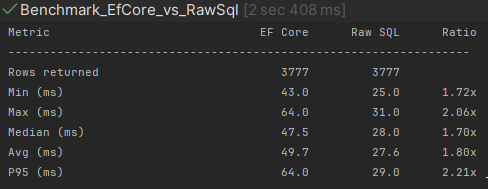
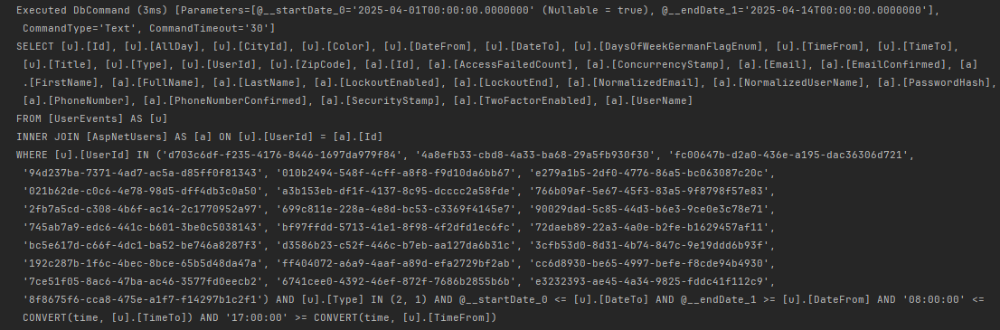
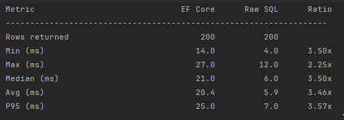
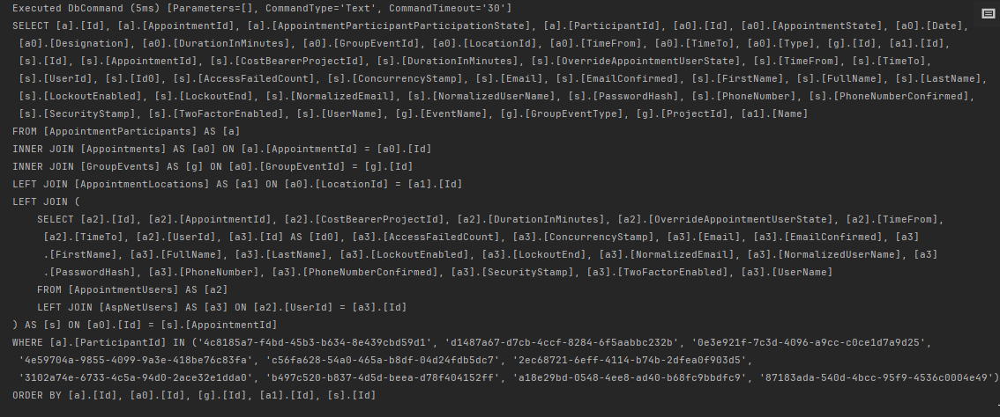
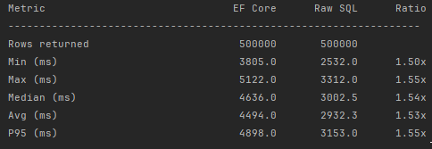
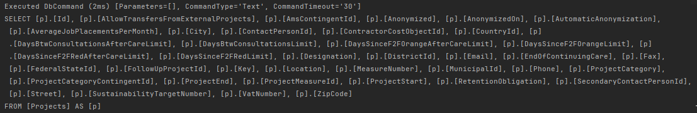

# Speed Up ORM

I made a deep research, although deep is relative, because I could not even imagine in my head how much we pay for the convenience of usage Entity Framework Core and to work with models in the domain logic. Expression Visitors, Change Trackers, SqlGenerators, InternalEntityEntry, so many things involved just to get a user from the database, this is crazy. I touched all important concepts, but still on the surface, although I needed mostly a week to debug, research on the internet and with claude. I write my notes in obsidian, so the [[]] everywhere are just internal reference to other notes. Research results are after experiments.


## 1. Complex Filtering

I just opened the random class and saw a fat query with nested `Where()` and complex conditions.

```cs
List<UserEvent> userEvents = await dbContext.UserEvents.AsNoTracking()
    .Where(x => filteredProjectAdvisorIds.Contains(x.UserId))
    .Where(x => x.Type == UserEventType.Presence || x.Type == UserEventType.Absence)
    .Where(x => startDateAsDateTime <= x.DateTo && endDateAsDateTime >= x.DateFrom)
    .Where(x => requestDto.StartTime.ToTimeSpan() <= x.TimeTo.TimeOfDay)
    .Include(x => x.User)
    .ToListAsync();
```

I realized later, that maybe this was not the best query to test, but I already have the results. Why not the best? Because we do not materialize a lot of entities here + we use the `AsNoTracking()`, so the results will not be attached to the `ChangeTracker`. The query just looked ugly and I though, if you are already ugly, then we can rewrite it with SQL and not that much changes :) The idea here is that we want to figure out when advisor is free for participant meetings. Then technically we find all presence/absence entries for the given advisor that overlap with a date range and selected time. Initial query also loaded the User, to get the full name + it loaded everything and not just the data which it needed later, so I extracted the required data into a structure and made a proper select:

```
cmd.CommandText = $@"
            SELECT
                ue.[Id], ue.[Title], ue.[DateFrom], ue.[DateTo],
                ue.[TimeFrom], ue.[TimeTo], ue.[DaysOfWeekGermanFlagEnum],
                ue.[UserId], u.[FullName] AS UserFullName,
                ue.[Type], ue.[ZipCode], ue.[CityId]
            FROM [UserEvents] ue
            INNER JOIN [AspNetUsers] u ON u.[Id] = ue.[UserId]
            WHERE ue.[UserId] IN ({string.Join(", ", inParams)})
              AND ue.[Type] IN (@typePresence, @typeAbsence)
              AND @startDate <= ue.[DateTo]
              AND @endDate   >= ue.[DateFrom]
              AND @startTime <= CAST(ue.[TimeTo] AS TIME)
              AND @endTime   >= CAST(ue.[TimeFrom] AS TIME)";
```

I created a separate project for that, bootstrapped the `DbContext` and used `testcontainers` to get the db running quickly. Then I kindly asked my friend to give me tests and measure the execution time, show me the generated SQL by the EfCore and make sure that queries returned identical results. For this query I got following results:




The queries are almost identical, the difference is only in the CAST and CONVERT SQL functions, but this is negligible. What interesting is, that the actual query according to the EfCore logs took only 3ms, but  the AVG in both cases is more than 20ms. So even the direct approach needs 6x times more that the query itself to make the request, get response and materialize it. EfCore sucks with 10x. So the general improvement is only 2x, so WHERE clauses are not the actual targets, we need more `Include()` and missing `AsNoTracking()`.


## 2. Multiple Includes without `AsNoTracking()` where we do not need all info

System exposes an API endpoint for the app which participants use to get their group event appoinments. They see then the information about where and when this appointment takes place, what group event type it has and who is the advisor. Here is the existng query for that:

```cs
db.AppointmentParticipants
            .Where(x => TargetParticipantIds.Any(y => y == x.ParticipantId))
            .Where(x => !OnlyFutureDates || x.Appointment!.Date >= DateTime.Today.Date)
            .Include(x => x.Appointment)
                .ThenInclude(x => x!.AppointmentUsers)
                    .ThenInclude(x => x.User)
            .Include(x => x.Appointment)
                .ThenInclude(x => x!.GroupEvent)
            .Include(x => x.Appointment)
                .ThenInclude(x => x!.Location);
```

We load the User for each AppointmentUser to retrieve the advisor id of the first advisor later when mapping the result to the DTO. Group Event is retrieved only to get the display name of the group event type. Location is also retrieved only to get its name. And here is the problem - if we carelessly do such queries, EfCore will materialize tons of objects and attach them to the tracker, because we do not use the `AsNoTracking()` here. Every `User` is an `ApplicationUser` which comes from the `ASP.NET`. It has 20+ properties, and we load them all. But essentially we need only the name of the first user... `GroupEvent` does not contain that much info, but the `Appointment` itself has a lot of information. We join 5 tables, select all columns to extract at the end only 8 scalar properties. Results can be clearly seen on the pictures:




The query itself which was generated by the EfCore took 5ms but with all materialization it takes 25. When we properly select needed values, take only the first advisor on the DB side, then the raw SQL query gives us 7ms, and I think the query itself took like 1-2ms.

```
cmd.CommandText = $@"
            SELECT
                ap.[Id]              AS AppointmentParticipantId,
                a.[Date],
                a.[TimeFrom],
                a.[TimeTo],
                a.[Type]             AS AppointmentType,
                ge.[GroupEventType],
                loc.[Name]           AS LocationName,
                firstUser.[FullName] AS AdvisorName,
                firstUser.[UserId]   AS AdvisorId
            FROM [AppointmentParticipants] ap
            INNER JOIN [Appointments] a          ON a.[Id] = ap.[AppointmentId]
            LEFT  JOIN [GroupEvents] ge          ON ge.[Id] = a.[GroupEventId]
            LEFT  JOIN [AppointmentLocations] loc ON loc.[Id] = a.[LocationId]
            OUTER APPLY (
                SELECT TOP 1 au.[UserId], u.[FullName]
                FROM [AppointmentUsers] au
                INNER JOIN [AspNetUsers] u ON u.[Id] = au.[UserId]
                WHERE au.[AppointmentId] = a.[Id]
                ORDER BY au.[Id]
            ) firstUser
            WHERE ap.[ParticipantId] IN ({string.Join(", ", inParams)}) {futureFilter}";
```

To be more realistic, I seeded 5000 users, 2000 group events where each has 20 appointments(maybe too much). Each appoinment is assigned to 1-4 advisors and each participant gets ~100 appointments. 4x raw SQL beats EfCore. Of course we could optimize the initial query, do `AsNoTracking()` and properly select needed values, but this would not procude such interesting results :)


## 3. Simple select all for a big number of entities

I was just interested what will be the difference if we take a fat object like the `Project` in our case which contains ~40 scalars and spawn like 500_000 of them in the db, what will be the overhead of the EfCore. Because in some way there are everywhere such queries which just select all entities, maybe with ordering. Of course all modern website use pagination and do not query 500_000 items at once if it is not a studen project, but still :). The results are interesting from the point, that actually the database is not that often the bottleneck




The produces 1.5x or 2s is exactly the overhead of materialization done by the ef core on all these intermediate layers. Actually, not that much, I thought it will be more ;)

---

# <u>Instantiation </u>

When we declare the properties on the custom [[Microsoft.EntityFrameworkCore.DbContext]] class as [[Microsoft.EntityFrameworkCore.DbSet]], we just make us convenience methods. We could do the same with `context.Set<Blog>()` method. But when access these properties, we do not get the [[System.NullReferenceException]]. Because there is an initialization happening in the constructor of the `DbContext`:

```cs
ServiceProviderCache.Instance.GetOrAdd(options, providerRequired: false)  
    .GetRequiredService<IDbSetInitializer>()  
    .InitializeSets(this);
```

The `InitializaSets` will go through all public properties of type [[Microsoft.EntityFrameworkCore.DbSet]] with setter and <u>find(and then cache) the delegate for setter the implementation</u> of [[Microsoft.EntityFrameworkCore.DbSet]] which is the [[Microsoft.EntityFrameworkCore.Internal.InternalDbSet]]. This is done here:

```cs
public virtual void InitializeSets(DbContext context)  
{  
    foreach (var setInfo in _setFinder.FindSets(context.GetType())
								      .Where(p => p.Setter != null))  
    {        
	    setInfo.Setter!.SetClrValueUsingContainingEntity(
		    context,            
		    ((IDbSetCache)context).GetOrAddSet(_setSource, setInfo.Type)
		);  
    }}
```

The [[Microsoft.EntityFrameworkCore.DbSetSource]] is the default implementation of the [[Microsoft.EntityFrameworkCore.IDbSetSource]] is used to create the delegate using the runtime `MakeGenericMethod` :

```cs
private object CreateCore(DbContext context, Type type, string? name, MethodInfo createMethod)
        => _cache.GetOrAdd(
            (type, name),
            static (t, createMethod) => (Func<DbContext, string?, object>)createMethod
                .MakeGenericMethod(t.Type)
                .Invoke(null, null)!,
            createMethod)(context, name);
            
[UsedImplicitly]  
    private static Func<DbContext, string?, object> CreateSetFactory<TEntity>()  
        where TEntity : class  
        => (c, name) => new InternalDbSet<TEntity>(c, name);  
}
```

The produced delegate is the stored in the [[Microsoft.EntityFrameworkCore.IDbSetCache]] or in the [[Microsoft.EntityFrameworkCore.DbContext]] itself because it implements the `Cache`.


# <u>Initialization</u>


For most of the work the [[Microsoft.EntityFrameworkCore.DbContext]] uses the [[Microsoft.EntityFrameworkCore.Internal.IDbContextDependencies]] and the [[Microsoft.EntityFrameworkCore.Infrastructure.DatabaseFacade]] to perform the **Database** related operations like start a `Transaction`. But the querying itself uses the [[Microsoft.EntityFrameworkCore.Internal.IDbContextDependencies]], which are retrieved from the `InternalServiceProvider`:

```cs
private IDbContextDependencies DbContextDependencies  
{  
    [DebuggerStepThrough]  
    get  
    {  
        CheckDisposed();  
  
        return _dbContextDependencies ??= InternalServiceProvider.GetRequiredService<IDbContextDependencies>();  
    }
}
```

And the `InternalServiceProvider` is retrieved from the [[Microsoft.EntityFrameworkCore.Internal.IDbContextServices]]:

```cs
private IServiceProvider InternalServiceProvider => ContextServices.InternalServiceProvider;
```

And when we touch the getter of the `ContextServices`, the actual initialization of the [[System.IServiceProvider]] starts and also the `Scope` is created, so that every [[Microsoft.EntityFrameworkCore.DbContext]] is isolated from each other:

```cs
private IDbContextServices ContextServices  
{  
    get  
    {  
        CheckDisposed();  
  
        try  
        {  
            _initializing = true;  
  
            var optionsBuilder = new DbContextOptionsBuilder(_options);  
  
            OnConfiguring(optionsBuilder);  
  
            var options = optionsBuilder.Options;  
  
            _serviceScope = ServiceProviderCache.Instance.GetOrAdd(options, providerRequired: true)  
                .GetRequiredService<IServiceScopeFactory>()  
                .CreateScope();  
  
            var scopedServiceProvider = _serviceScope.ServiceProvider;  
  
            var contextServices = scopedServiceProvider.GetRequiredService<IDbContextServices>();  
  
            contextServices.Initialize(scopedServiceProvider, options, this);  
  
            _contextServices = contextServices;  
  
	        return _contextServices;  
    }}
```

Exactly here we call the `OnConfiguring()` with the provided [[Microsoft.EntityFrameworkCore.DbContextOptions]] or with empty if we create the `DbContext` without the options object. *This initialization happens only when we start using the library doing queries or using the change tracking mechanism.*


# <u>Internal Service Provider</u>


[[Microsoft.EntityFrameworkCore]] uses its own internal [[Dependency Injection]] framework for all its services. For each [[Microsoft.EntityFrameworkCore.DbContext]] we create a new scope and then for that scope we create the services as shown in the constructor above. The services are defined in the [[Microsoft.EntityFrameworkCore.Infrastructure]]:

```cs
public static readonly IDictionary<Type, ServiceCharacteristics> CoreServices  
    = new Dictionary<Type, ServiceCharacteristics>  
    {   { typeof(IDbSetFinder), new ServiceCharacteristics(ServiceLifetime.Singleton) },  
        { typeof(IDbSetInitializer), new ServiceCharacteristics(ServiceLifetime.Singleton) },  
        { typeof(IDbSetSource), new ServiceCharacteristics(ServiceLifetime.Singleton) }
        ...
}
```

In the same class we have the `TryAddCoreServices()` method which adds all of them:

```cs
public virtual EntityFrameworkServicesBuilder TryAddCoreServices()  
{  
    TryAdd<IDbSetFinder, DbSetFinder>();  
    TryAdd<IDbSetInitializer, DbSetInitializer>();  
    TryAdd<IDbSetSource, DbSetSource>();  
    TryAdd<IEntityFinderSource, EntityFinderSource>();
}
```

Concrete database providers like [[Microsoft.EntityFrameworkCore.SqlServer]] create their own implementations which are then registered:

```cs
public override void ApplyServices(IServiceCollection services)  
{  
    switch (_engineType)  
    {        
	    case SqlServerEngineType.SqlServer:  
            services.AddEntityFrameworkSqlServer();  
            break;  
        case SqlServerEngineType.AzureSql:  
            services.AddEntityFrameworkAzureSql();  
            break;  
        case SqlServerEngineType.AzureSynapse:  
            services.AddEntityFrameworkAzureSynapse();  
            break;  
    }
}    
```

The `ApplyServices` is defined on the [[Microsoft.EntityFrameworkCore.Infrastructure.IDbContextExtension]] which is added when we call the `UseSqlServer()` in the `OnConfiguringMethod()` which has already been called in the constructor:

```cs
public static DbContextOptionsBuilder UseSqlServer(  
    this DbContextOptionsBuilder optionsBuilder,  
    Action<SqlServerDbContextOptionsBuilder>)  
{  
    var extension = GetOrCreateExtension<SqlServerOptionsExtension>;
    extension = extension.WithEngineType(SqlServerEngineType.SqlServer);  
    optionsBuilder.AddOrUpdateExtension(extension);
    return ApplyConfiguration(optionsBuilder, sqlServerOptionsAction);  
}
```

And the services of the extensions *are added before the* `AddCoreService()`, that's why there is no problem with getting the correct setup:

```cs
private static bool ApplyServices(IDbContextOptions options, services)  
{  
    var coreServicesAdded = false;  
  
    foreach (var extension in options.Extensions)  
    {        
	    extension.ApplyServices(services);  
  
        if (extension.Info.IsDatabaseProvider)  
	        coreServicesAdded = true;  
    }  
    
    if (coreServicesAdded)  
		return true;  
    
    new EntityFrameworkServicesBuilder(services).TryAddCoreServices();  
  
    return false;  
}
```


# <u>Model building</u>


To make queries to to the database from the models which we define [[Microsoft.EntityFrameworkCore]] configured the **Model** which contains database related information like **table name**, **indices** or **primary/foreign keys**. The final model is used not only in runtime but also at the [[Design Time in EFCore]]. It is accessible on the [[Microsoft.EntityFrameworkCore.Internal.IDbContextServices]]:

```cs
public virtual IModel Model => field ??= CreateModel(designTime: false);  

public virtual IModel DesignTimeModel => field ??= CreateModel(designTime: true);
```

The actual model creation is delegated to the [[Microsoft.EntityFrameworkCore.Infrastructure.IModelSource]] which of course caches the provided model using the combination of the [[Microsoft.EntityFrameworkCore.DbContext]] and the `designTime` flag:

```cs
public virtual IModel GetModel(  
    DbContext context,  
    ModelCreationDependencies modelCreationDependencies,  
    bool designTime)  
{  
    var cache = Dependencies.MemoryCache;  
    var cacheKey = Dependencies.ModelCacheKeyFactory.Create(context, designTime);  
    if (!cache.TryGetValue(cacheKey, out IModel? model))
    {
	    var designTimeModel = CreateModel(context, modelCreationDependencies, designTime: true);  
	  var runtimeModel = ...
    }
    return model;  
}
```

And in the internal `CreateModel` there is an explanation to why all internet sources say that there are three ways to configure [[Microsoft.EntityFrameworkCore]] : convention, attributes and fluent API(which is executed by the `IModelCustomizer`). Okay attribute configuration is also a **convention configuration implementation**, but this does not matter :)

```cs
protected virtual IModel CreateModel(  
    DbContext context,  
    IConventionSetBuilder conventionSetBuilder,  
    ModelDependencies modelDependencies)  
{  
    Check.DebugAssert(context != null, "context == null");  
  
    var modelConfigurationBuilder = new ModelConfigurationBuilder(  
        conventionSetBuilder.CreateConventionSet(),  
        context.GetInfrastructure());  
  
    context.ConfigureConventions(modelConfigurationBuilder);  
  
    var modelBuilder = modelConfigurationBuilder.CreateModelBuilder(modelDependencies);  
  
    Dependencies.ModelCustomizer.Customize(modelBuilder, context);  
  
    return (IModel)modelBuilder.Model;  
}
```


## <u>1. Conventions</u>

*If name of the property ends with `Id` then it is the primary key* - example of a convention. They can be provided by the library itself or by **external providers**. Even we can create our own conventions or replace existing. Default convention set looks like this:

```cs
public virtual ConventionSet CreateConventionSet()  
{  
    var conventionSet = new ConventionSet();  
  
    conventionSet.Add(new ModelCleanupConvention(Dependencies));  
  
    conventionSet.Add(new NotMappedTypeAttributeConvention(Dependencies));  
    conventionSet.Add(new OwnedAttributeConvention(Dependencies));  
    conventionSet.Add(new ComplexTypeAttributeConvention(Dependencies));  
    conventionSet.Add(new KeylessAttributeConvention(Dependencies));  
    conventionSet.Add(new EntityTypeConfigurationAttributeConvention(Dependencies));  
    conventionSet.Add(new NotMappedMemberAttributeConvention(Dependencies));  
    conventionSet.Add(new BackingFieldAttributeConvention(Dependencies));  
    conventionSet.Add(new ConcurrencyCheckAttributeConvention(Dependencies));  
    conventionSet.Add(new DatabaseGeneratedAttributeConvention(Dependencies));  
    conventionSet.Add(new RequiredPropertyAttributeConvention(Dependencies));  
    conventionSet.Add(new MaxLengthAttributeConvention(Dependencies));  
    conventionSet.Add(new StringLengthAttributeConvention(Dependencies));  
    conventionSet.Add(new TimestampAttributeConvention(Dependencies));  
    conventionSet.Add(new ForeignKeyAttributeConvention(Dependencies));  
    conventionSet.Add(new UnicodeAttributeConvention(Dependencies));  
    conventionSet.Add(new PrecisionAttributeConvention(Dependencies));  
    conventionSet.Add(new InversePropertyAttributeConvention(Dependencies));  
    conventionSet.Add(new DeleteBehaviorAttributeConvention(Dependencies)); 
  
	...
	
    return conventionSet;  
}
```

Concrete providers add their own conventions, like the `OnDeleteCascade` in case of the `SqlServer`:

```cs
public class SqlServerConventionSetBuilder : RelationalConventionSetBuilder

public override ConventionSet CreateConventionSet()  
{  
    var conventionSet = base.CreateConventionSet();  
  
	...
	
    conventionSet.Replace<CascadeDeleteConvention>(  
        new SqlServerOnDeleteConvention(Dependencies, RelationalDependencies));  
    conventionSet.Replace<StoreGenerationConvention>(
}
```

As said, we also can manipulate the conventions in the `ConfigureConventions` and get access to the `ModelConfigurationBuilder`, which builds the `ModelBuilder`, which in turns produces the final `IModel` :

```cs
protected override void ConfigureConventions(configurationBuilder) 
{ 
	configurationBuilder.Properties<string>() 
						.AreUnicode(false) 
						.HaveMaxLength(1024); 
						
	configurationBuilder.Properties<decimal>() 
						.HavePrecision(10, 3);
						
	configurationBuilder.Properties<DateTime>() 
						.HaveConversion<long>(); 
}
```

What is even more interesting, apart from that we can create our own conventions and remove existing ones:

```cs
configurationBuilder.Conventions.Remove(typeof(ForeignKeyIndexConvention));

configurationBuilder.Conventions.Add(_ => new SnakeCaseNamingConvention());
```

Our custom conventions can hook into the model building process and will be called after some specific step is completed! And this is done through clean interfaces, not `events`. We can implement : `IModelFinalizingConvention` and will be notified when all entity types and properties have been discovered. Really cool!


## <u>2. Attributes</u>

[[Microsoft.EntityFrameworkCore]] uses the [[․NET]] special attributes from the [[System.ComponentModel.DataAnnotations]] package which are used to annotate properties with additional info:

```cs
using System.ComponentModel.DataAnnotations;

public class User
{
	[Key]
	public string Key { get; set; }

    [MaxLength(50)]
    public string Name { get; set; }
}   
```

Because we do not follow the convention for the `Key` property for whatever reason, we can still mark it with `[Key]` to set is as primary key. Or we can apply the `MaxLength` constraint for the string.

## <u>3. Fluent API</u>

The last step in the model configuration method:

```cs
var modelBuilder = modelConfigurationBuilder.CreateModelBuilder(modelDependencies);  
  
Dependencies.ModelCustomizer.Customize(modelBuilder, context);  
  
return (IModel)modelBuilder.Model; 
```

is the last one and is exactly the place where application of the fluent API configuration takes place. They can be defined in the `OnModelCreating()` on the underlying [[Microsoft.EntityFrameworkCore.DbContext]] or split into the [[Microsoft.EntityFrameworkCore.IEntityTypeConfiguration]] which is a good practice to keep the configuration of every entity separate. <u>These configurations are explicit and will override all existing convention and data attributes settings.</u>


# <u>Query pipelines</u>

On the query level [[Microsoft.EntityFrameworkCore]] works extensively with [[System.Linq.Expressions.Expression]] to extract the information about query and translate it to `SQL`.

```cs
[DynamicDependency("Where`1", typeof(Enumerable))]  
public static IQueryable<TSource> Where<TSource>(this IQueryable<TSource> source, Expression<Func<TSource, bool>> predicate)  
{  
    ArgumentNullException.ThrowIfNull(source);  
    ArgumentNullException.ThrowIfNull(predicate);  
  
    return source.Provider.CreateQuery<TSource>(  
        Expression.Call(  
            null,  
            new Func<IQueryable<TSource>, Expression<Func<TSource, bool>>, IQueryable<TSource>>(Where).Method,  
            source.Expression, Expression.Quote(predicate)));  
}
```

Here [[Microsoft.EntityFrameworkCore]] works with `IQueryable` and `IQueryableProvider`. The first one is just an abstraction of something we can work with, whereas the second one is the actual path to the items delivered by the `IQueryable`. If we look at the [[Microsoft.EntityFrameworkCore.Internal.InternalDbSet]] then we will see that it implements the `IQueryable` and is the source of the querying. Makes sense, because we always query on the [[Microsoft.EntityFrameworkCore.DbSet]] of the [[Microsoft.EntityFrameworkCore.DbContext]]. The `Where()` returns us the `IQueryable` and allows further chaining of queries and thus expanding the resulting [[System.Linq.Expressions.Expression]]. Terminal methods call then the `Execute` method of the `IQueryProvider` which then delegates its work to the `IQueryCompiler`:

```cs
public static bool Any<TSource>(this IQueryable<TSource> source, Expression<Func<TSource, bool>> predicate)  
{    
    return source.Provider.Execute<bool>(  
        Expression.Call(  
            null,  
            new Func<IQueryable<TSource>, Expression<Func<TSource, bool>>, bool>(Any).Method,  
            source.Expression, Expression.Quote(predicate)));  
}

public virtual TResult Execute<TResult>(Expression expression)  
    => _queryCompiler.Execute<TResult>(expression);
```

And here starts the actual "magic" and translation of our expression into SQL. The query compiler normalises the expression to reuse it further and emits the `compiledQuery` function which is then executed:

```cs
private TResult ExecuteCore<TResult>(Expression query, bool async, CancellationToken cancellationToken)  
{  
    var queryContext = _queryContextFactory.Create();  
  
    queryContext.CancellationToken = cancellationToken;  
  
    var queryAfterExtraction = ExtractParameters(query, queryContext, _logger);  
  
    var compiledQuery  
        = _compiledQueryCache  
            .GetOrAddQuery(  
                _compiledQueryCacheKeyGenerator.GenerateCacheKey(queryAfterExtraction, async),  
                () => RuntimeFeature.IsDynamicCodeSupported  
                    ? CompileQueryCore<TResult>(_database, queryAfterExtraction, _model, async)  
                    : throw new InvalidOperationException("Query wasn't precompiled and dynamic code isn't supported (NativeAOT)"));  
  
    return compiledQuery(queryContext);  
}
```

The actual query compilation is further delegated to the `IDatabase` which further delegates it to the `QueryCompilationContext` where we start using our visitors. [[Microsoft.EntityFrameworkCore]] uses visitor pattern for expression processing:

```cs
public virtual Expression<Func<QueryContext, TResult>> CreateQueryExecutorExpression<TResult>(Expression query)  
{  
    var queryAndEventData = Logger.QueryCompilationStarting(Dependencies.Context, _expressionPrinter, query);  
    var interceptedQuery = queryAndEventData.Query;  
  
    var preprocessedQuery = _queryTranslationPreprocessorFactory.Create(this).Process(interceptedQuery);  
    var translatedQuery = _queryableMethodTranslatingExpressionVisitorFactory.Create(this).Translate(preprocessedQuery);  
    var postprocessedQuery = _queryTranslationPostprocessorFactory.Create(this).Process(translatedQuery);  
  
    var compiledQuery = _shapedQueryCompilingExpressionVisitorFactory.Create(this).Visit(postprocessedQuery);  
  
    var compiledQueryWithRuntimeParameters = InsertRuntimeParameters(compiledQuery);  
  
    return Expression.Lambda<Func<QueryContext, TResult>>(  
        compiledQueryWithRuntimeParameters,        QueryContextParameter);  
}

public virtual Expression Translate(Expression expression)  
{  
    var translated = Visit(expression);
}
```

So our translation visitor will translate the expressions to the actual `SQL` and visiting the `postProcessedQuery` will also invoke the `Materializer` to be able read the results back.


# <u>Change Tracking</u>

This part comes when we want to add, delete or remove entities. And exploring how the internals work actually answers the main question whey the **reference equality** plays that big role in the change tracking mechanism. For entity to enter the context and thus being able us to produce some `SQL` when we call the `SaveChanges` **it needs to be tracked.** We can do it by calling the `Add()`, `Attach()`, `Update()`, `Remove()` or by the **query materialization** when we make queries to the database, what was previously discussed. If we do not add the `AsNoTracking()` to the query, then all resulting entities will be tracked by the EfCore. As an example let's take the `Add()` method:

```cs
public virtual EntityEntry Add(object entity)  
{  
    CheckDisposed();  
  
    return SetEntityState(Check.NotNull(entity, nameof(entity)), EntityState.Added);  
}

private EntityEntry SetEntityState(object entity, EntityState entityState)  
{  
    var entry = EntryWithoutDetectChanges(entity);  
  
    SetEntityState(entry.GetInfrastructure(), entityState);  
  
    return entry;  
}
```

Here comes the central bookkeeping object the [[Microsoft.EntityFrameworkCore.ChangeTracking.Internal.InternalEntityEntry]] which holds the entity reference, the original value snapshot and tracks which properties should be marked as modified. In the example above we create the `InternalEntityEntry` with the state added and the tracking starts. The driving power is however in the [[Microsoft.EntityFrameworkCore.ChangeTracking.Internal.StateManager]]:

```cs
private readonly EntityReferenceMap _entityReferenceMap = new(hasSubMap: true);  

private IIdentityMap? _identityMap0;  

private IIdentityMap? _identityMap1;  

private Dictionary<IKey, IIdentityMap>? _identityMaps;
```

The reference map maps the objects to the [[Microsoft.EntityFrameworkCore.ChangeTracking.Internal.InternalEntityEntry]] instances by the reference, this is why reference equality plays in EfCore a very important role. We also want to keep the identity unique and avoid having two tracked entities with the same **Id**.

Under the hood the [[Microsoft.EntityFrameworkCore.ChangeTracking.Internal.InternalEntityEntry]] holds the `EntityState` which can be `Detached`, `Unchanged`, `Added`, `Modified`, `Deleted` and depends on the way it came to the `DbContext`. If we use the materialization, then the state is `Unchanged`, because the query comes directly from the DB. When we add, then `Added` and so on. This is important, because later when we call `SaveChanges()` on the `DbContext` is called, it will do the change detection based on the state of the entity. Under the hood it uses the **snapshot based** change detection. The `Snapshot` is stored in the `InternalEntityEntry` :

```cs
public sealed partial class InternalEntityEntry : IUpdateEntry  
{  
    private readonly StateData _stateData;  
    private OriginalValues _originalValues;  
    private RelationshipsSnapshot _relationshipsSnapshot;  
    private SidecarValues _temporaryValues;  
    private SidecarValues _storeGeneratedValues;  
    private readonly ISnapshot _shadowValues;
}
```

The change detection starts when we call the `SaveChanges()`: 

```cs
public virtual int SaveChanges(bool acceptAllChangesOnSuccess)  
{  
    CheckDisposed();  
  
    SavingChanges?.Invoke(this, new SavingChangesEventArgs(acceptAllChangesOnSuccess));  
  
    var interceptionResult = DbContextDependencies.UpdateLogger.SaveChangesStarting(this);  
  
    TryDetectChanges();
}

private void TryDetectChanges()  
{  
    if (ChangeTracker.AutoDetectChangesEnabled)  
    {        
	    ChangeTracker.DetectChanges();  
    }
}

// ChangeTracker

public virtual void DetectChanges()  
{  
    if (!_model.SkipDetectChanges)  
    {        
	    ChangeDetector.DetectChanges(StateManager);  
    }
}
```

Inside we iterate over all existing `InternalEntityEntry` and if the entity is not deleted or detached, then we do the local changes detection:

```cs
foreach (var entry in stateManager.ToList()) // Might be too big, but usually _all_ entities are using Snapshot tracking  
{  
    switch (entry.EntityState)  
    {        
	    case EntityState.Detached:
            break;  
        case EntityState.Deleted:  
            if (entry.SharedIdentityEntry != null)  
            {                
	            continue;  
            }  
            goto default;  
        default:  
            if (LocalDetectChanges(entry))  
            {   
	             changesFound = true;  
            }  
            break;  
    }
}
```

And in the `LocalDetectChanges()` things get slow and this what we pay for ORM, including query compilation from our expressions in LINQ. `EfCore` goes through all properties of the entities, including nav properties and collections and compares the **original** property value with current and if they differ, marks as modified. This will finally emit us either an `UPDATE` or `INSERT` statement. The entities which produce those statements( + `Delete`) are obtained in the `StateManager` in the form of `IUpdateEntity` and passed down to the `IDatabase` implementation, which for relational database providers has the [[Microsoft.EntityFrameworkCore.Storage.RelationalDatabase]] implementation:

```cs
private static int SaveChanges(StateManager stateManager, bool acceptAllChangesOnSuccess)  
{  
    if (stateManager.ChangedCount == 0)  
	    return 0;  
	    
    var entriesToSave = stateManager.GetEntriesToSave(cascadeChanges: true);  
  
    stateManager.SavingChanges = true;  
    var result = stateManager.SaveChanges(entriesToSave);  
  
    if (acceptAllChangesOnSuccess)  
    {            
	    AcceptAllChanges((IReadOnlyList<IUpdateEntry>)entriesToSave);  
    }  
    
    return result;  
}

protected virtual int SaveChanges(IList<IUpdateEntry> entriesToSave)  
{  
    using var _ = _concurrencyDetector?.EnterCriticalSection();  
  
    EntityFrameworkMetricsData.ReportSavingChanges();  
  
    return _database.SaveChanges(entriesToSave);  
}
```

For the relational database the pipeline involves [[Microsoft.EntityFrameworkCore.Update.Internal.CommandBatchPreparer]] and [[Microsoft.EntityFrameworkCore.Update.Internal.BatchExecutor]]. The first one provides us with `IEnumerable<ModificationCommandBatch>` which can be `INSERT`, `UPDATE` or `DELETE`. Each batch must be "completed" and because each `ModificationBatch` is provided by the concrete database provider, it triggers it own `IUpdateSqlGenerator`:

```cs
public virtual IEnumerable<ModificationCommandBatch> BatchCommands(  
    IList<IUpdateEntry> entries,  
    IUpdateAdapter updateAdapter)  
{    
    for (var commandSetIndex = 0; commandSetIndex < commandSets.Count; commandSetIndex++)  
    {        
	    var batches = CreateCommandBatches(..);
    }
}

CreateCommandBatches()
{
	...
	batch.Complete(moreBatchesExpected: true);
}

public class SqlServerModificationCommandBatch
{
	protected new virtual ISqlServerUpdateSqlGenerator UpdateSqlGenerator  
    => (ISqlServerUpdateSqlGenerator)base.UpdateSqlGenerator;
    
    public override void Complete(bool moreBatchesExpected)  
    {  
	    ApplyPendingBulkInsertCommands();  
  
	    base.Complete(moreBatchesExpected);  
	}
	
	private void ApplyPendingBulkInsertCommands()  
	{  
	    var commandPosition = ResultSetMappings.Count;  
	    var wasCachedCommandTextEmpty = IsCommandTextEmpty;  
	    var resultSetMapping = UpdateSqlGenerator.AppendBulkInsertOperation(  
        SqlBuilder, _pendingBulkInsertCommands, commandPosition, out var requiresTransaction);
    }
}
```

Each SQL generator has its own implementations of how commands are generated:

```cs
SqlServerUpdateSqlGenerator

protected override void AppendInsertCommand(  
    StringBuilder commandStringBuilder,  
    string name,  
    string? schema,  
    IReadOnlyList<IColumnModification> writeOperations,  
    IReadOnlyList<IColumnModification> readOperations)  
{  
    // In SQL Server the OUTPUT clause is placed differently (before the VALUES instead of at the end)  
    AppendInsertCommandHeader(commandStringBuilder, name, schema, writeOperations);  
    AppendOutputClause(commandStringBuilder, readOperations);  
    AppendValuesHeader(commandStringBuilder, writeOperations);  
    AppendValues(commandStringBuilder, name, schema, writeOperations);  
    commandStringBuilder.AppendLine(SqlGenerationHelper.StatementTerminator);  
}

...
```

After all preparations the `BatchExecutor` starts a transaction and executes all commands one by one:

```cs
transaction = connection.BeginTransaction();  

do  
{  
    batch = batchEnumerator.Current;  
    batch.Execute(connection);  
    rowsAffected += batch.ModificationCommands.Count;  
}  
while (batchEnumerator.MoveNext());  
  
transaction!.Commit();
```

After successful execution, all `Added` and `Modified` entries are set to `Unchanged` (their original values snapshots are updated to the current values). All `Deleted` entries are set to `Detached` and removed from the `StateManager`. And of course we also read back the generated values into our tracked entities such as `ID` or `RowVersion`.